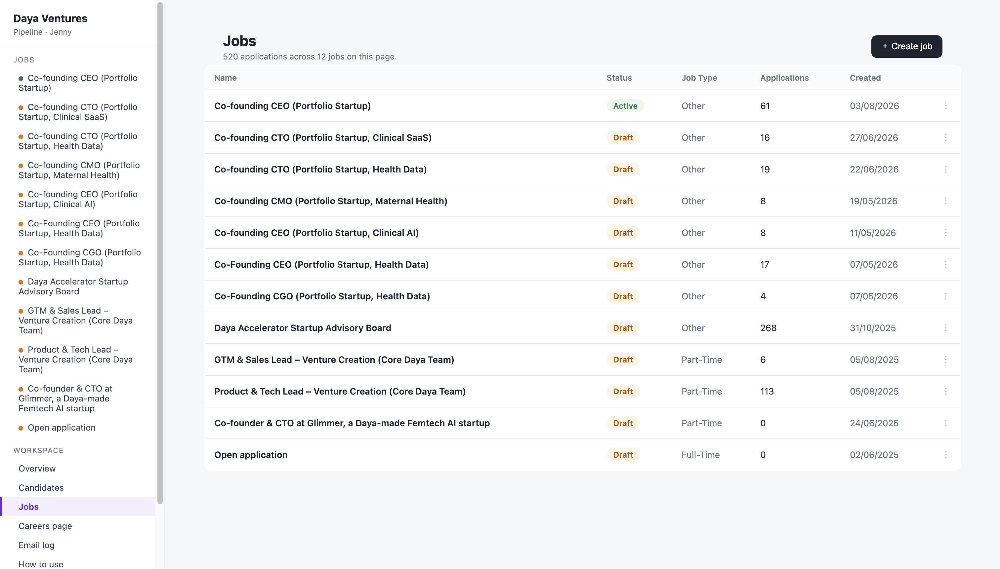
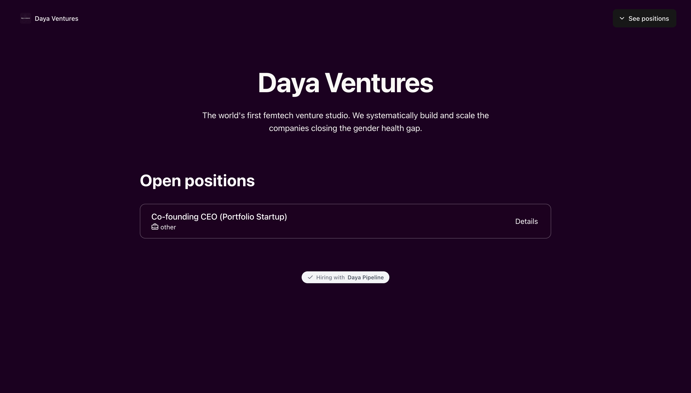
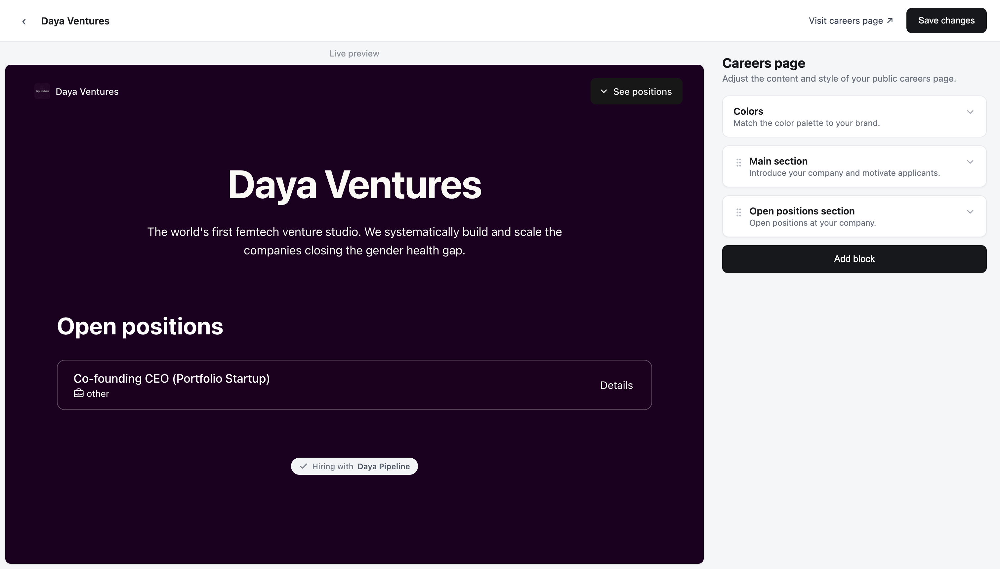

# ATS

An applicant tracking system running entirely on Cloudflare Workers: a kanban hiring pipeline, a careers page builder, job board publishing, and a public application flow. Server-rendered HTML with a bit of vanilla JavaScript. No npm dependencies, no build step.

## What's inside

- **Kanban pipeline.** Drag candidate cards between per-job columns, reorder the columns themselves, star favourites, suggest interviews, and reject with one click.
- **Candidates.** One list for every candidate, with tags, inline editing, search, filters, sorting and pagination.
- **Jobs.** Create, edit, publish, unpublish and close job posts. Publish a job and it appears on the public careers page.
- **Job settings.** Per job: general details, notification preferences, job board publishing (Monster, Jooble, Careerjet, Indeed, LinkedIn) and an application form builder.
- **Careers page builder.** A live-preview editor for the public careers site. Colors, hero copy, open positions, plus text, values, photo gallery, video and team members sections you can drag into any order.
- **Public pages.** Job detail pages with per-job custom questions and configurable fields. Applications land straight on the right board.
- **Email log.** Interview suggestions and outbound notifications are recorded instead of sent (demo mode, no provider wired).

## Stack

- Cloudflare Workers: one worker, ES modules
- Cloudflare D1 (SQLite): schema in `schema.sql`, migrations in `migrations/`
- Vanilla JavaScript and CSS, no frameworks or dependencies
- PBKDF2 password hashing (WebCrypto), session cookies, CSRF-protected forms

## Layout

```
src/
  index.js                  worker entry: router, auth, APIs, client script
  db.js                     data-access layer (D1)
  views.js                  server-rendered pages (shell, board, lists)
  careers.js                public careers page + job detail / apply flow
  careers-editor-client.js  careers page editor (live preview)
  logo.js                   embedded workspace logo
scripts/seed.mjs            demo data seeder
migrations/                 incremental SQL migrations
schema.sql                  full schema
```

## Local development

```bash
npm i -g wrangler
wrangler dev          # start the worker locally
wrangler d1 execute <db> --local --file=schema.sql
node scripts/seed.mjs
```

The seed script needs a `boards-all.json` export, which isn't included here because it contains real people's data.

## Screenshots

| Jobs | Careers page | Careers editor |
| --- | --- | --- |
|  |  |  |
